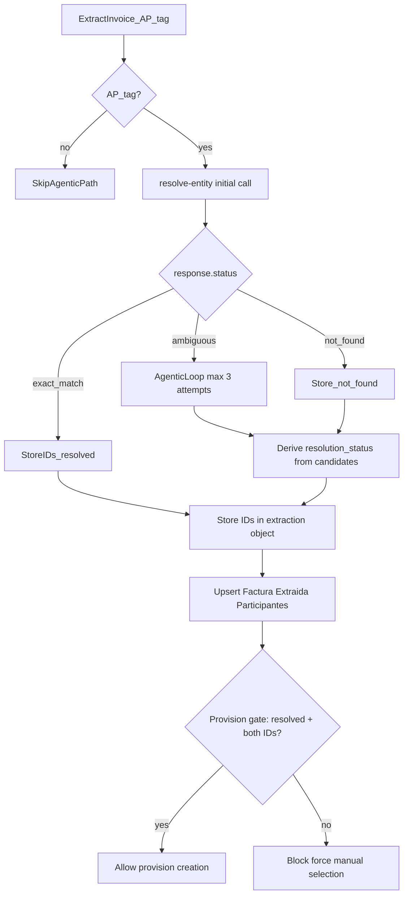

# PRD + Technical Spec: Agentic `resolve-entity` for AP Invoice Processing

**Audience:** Krishna Kapadia (implementation owner)  
**Project:** Logic Journeys — AI Invoice Processing module  
**Session source:** 2026-06-05 working session (see `sources/2026-06-05-krishna-session.*`)

---

# Part A — PRD

## 1. Overview

When the AI Invoice Processing module extracts an **accounts-payable (AP)** invoice, it must resolve the vendor to a directorio **entity ID** (`set-identity-directorio`) and **entity-address ID** (`set-identity-directorio-direccion`). This resolution is required before **provision creation** can proceed.

Today, vendor resolution is done via direct directorio queries. This PRD replaces that approach with an **agentic `resolve-entity` flow** called **in-line during extraction**, with explicit ambiguity handling and a hard **provision-creation gate**. The system must **never guess** when resolution is ambiguous — it must block and force human selection.

## 2. Problem statement

- Direct directorio queries return **ambiguous results** when data is dirty (duplicate entities, near-identical names, formatting variants like "SA" vs "S A").
- Booking the **wrong supplier** is the worst-case outcome; the API must stay exact and the data (or human) resolves ambiguity.
- Adding resolution as a **new workflow activity** would block downstream workflows that depend on the extraction record.
- Re-fetching the PDF inside the agent is **too expensive** (same document processed multiple times).
- The **`Factura Extraida Participantes`** table exists but is not written to; provision creation needs the final resolved entity-address ID from a normalized place.

## 3. Goals

| # | Goal |
|---|------|
| G1 | Resolve AP vendor → entity ID + entity-address ID at **extraction time**, once per invoice |
| G2 | Call `resolve-entity` **in-line** from existing extraction code (no new workflow activity) |
| G3 | Run the **agentic path only for AP-tagged** invoices |
| G4 | Populate **`Factura Extraida Participantes`** in the same extraction step |
| G5 | Handle ambiguity via a **capped agentic loop** (max 3 attempts) with endpoint-driven recommendations |
| G6 | **Never guess** — block provision creation when resolution is incomplete |
| G7 | Store resolved IDs in the **existing extraction object** (no new column on `factura extraída`) |

## 4. Non-goals

- **Re-fetching the PDF** inside the agentic loop (cost; excluded).
- Running the **agentic path** for commercial-invoice, signature, or unknown tags.
- Adding a **new workflow activity** for resolution.
- Building **directorio migration tooling** in this iteration (human cleanup of duplicates is a separate data-quality task; see `Topics/logic-journeys` → directorio cleanup).
- Changing the **booking approval** flow (booking still requires human approval regardless).

## 5. Key concepts

### 5.1 Global directory model

- There is a **global directory** of companies. An office creates a company once; sister offices **reuse the same entity** and add their own **address**.
- All addresses under one entity = **same legal entity, same country**. Multiple countries on one entity ID is blocked (= different legal entity).
- **Branches** can have separate AP/AR repositories → provisions attach to the **branch address**, not the parent.

### 5.2 The 1:1 invoice rule

An invoice is **always one company + one address**. Resolution target per AP vendor participant: **one entity ID + one entity-address ID**.

### 5.3 Two storage layers

| Layer | Table / object | Role |
|-------|----------------|------|
| First attempt | `clasificación activo digital` → `identity directorio` | Initial issuer match; applies beyond invoices |
| Final attempt | `Factura Extraida Participantes` | Where provision creation reads from; holds `resolution_status` |

### 5.4 Normalization

Invoices involve multiple companies (tenant, recipient, possibly shipper/consignee). Entity/address IDs live in **`Factura Extraida Participantes`**, not as repeated columns on the invoice row.

## 6. Functional requirements

### FR-1 — In-line resolution at extraction

While inserting the `factura extraída` record for an AP invoice, call `resolve-entity` from the existing extraction code path. Do not add a new workflow activity.

### FR-2 — AP-tag gate

Run the agentic resolution **only when the document tag is accounts-payable**. Commercial, signature, and unknown tags skip the agentic call.

### FR-3 — Single-pass extraction

Resolve once at extraction time. Do not re-fetch or re-process the source document inside the agent.

### FR-4 — Store IDs in extraction object

When resolved, store `set-identity-directorio` and `set-identity-directorio-direccion` inside the **existing extraction object** (no new column on the parent table).

### FR-5 — Populate Participantes

In the same extraction step, insert/update **`Factura Extraida Participantes`** with:
- `entity_id` (set-identity-directorio)
- `entity_address_id` (set-identity-directorio-direccion)
- `resolution_status` (see Part B)

### FR-6 — Agentic ambiguity loop

When `resolve-entity` returns `ambiguous`, run an agentic loop (max **3 attempts**) using allowed tools and endpoint `recommendations[]` to narrow or conclude. Stop when `exact_match`, `not_found`, or max attempts reached.

### FR-7 — Provision-creation gate

Enable provision creation **only when**:
- `entity_id` IS NOT NULL
- `entity_address_id` IS NOT NULL
- `resolution_status = resolved`

Otherwise: flag record incomplete and **force manual selection**.

### FR-8 — Human-resolution paths

Each non-`resolved` status must surface a clear human action (see §B.8).

## 7. Ambiguity scenarios

Three scenario classes drive design and testing. Endpoint returns 3 statuses; Participantes uses a finer 5-value enum derived from candidates.

### Scenario 1 — PDF-level ambiguity

The PDF is misleading: wrong company in the top-right, correct issuer hidden in small print.

- **Expected behavior:** Agent retries with additional params (tax ID, city, address) or checks previous resolutions. May resolve within 3 attempts or escalate to manual.

### Scenario 2 — Duplicate / low-quality directorio data

Two or more **distinct entity IDs** for what is effectively one company, or formatting variants that cannot be disambiguated.

**Examples:**
- Two **"Logic Solutions"** entries (two entity IDs).
- **MSC** — "Mediterranean Shipping Company **SA**" vs "**S A**", both Schryver Ecuador, **same address** → fully ambiguous; AI **cannot** pick.

- **Expected behavior:** After max attempts → `resolution_status = ambiguous_entity` → block → human cleans directorio (migrate invoices, deactivate duplicate).

### Scenario 3 — Company not found / not for tenant

**3a — Not found:** No matching entity in directorio.  
**3b — Address not for tenant:** Entity exists globally but **no entity-address for the processing tenant** (e.g. invoice processed by Schryver Morocco; Logic Solutions entity found but no Morocco address).

- **Expected behavior:** 3a → `not_found`. 3b → `address_not_for_tenant` (human creates tenant address).

### Scenario 1b — Address-level ambiguity (within one entity)

Company name resolves to **one entity_id** but multiple **entity_address_id** candidates are too similar.

- **Expected behavior:** Agent narrows by country/city/address line 1. If still ambiguous after 3 attempts → `ambiguous_address` → manual selection.

## 8. Acceptance criteria (PRD level)

| ID | Criterion |
|----|-----------|
| AC-1 | AP invoice extraction calls `resolve-entity` in-line; no new workflow activity added |
| AC-2 | Non-AP tags do not trigger agentic resolution |
| AC-3 | Resolved AP invoice has entity_id + entity_address_id in extraction object AND Participantes row |
| AC-4 | Participantes row has correct `resolution_status` for each scenario below |
| AC-5 | Provision creation blocked unless `resolution_status = resolved` with both IDs present |
| AC-6 | MSC duplicate (SA vs S A, same address) → `ambiguous_entity`, provision blocked |
| AC-7 | Schryver Morocco / Logic Solutions (entity, no tenant address) → `address_not_for_tenant` |
| AC-8 | Agentic loop stops at 3 attempts; PDF is never re-fetched |
| AC-9 | Manual selection path available for all non-resolved statuses |

---

# Part B — Technical Spec

## B.1 Architecture



**Integration point:** existing extraction code that inserts `factura extraída` — add the resolve call and Participantes write **before** the record is considered complete for downstream activities.

## B.2 Data model

### B.2.1 Extraction object (existing)

No new column on `factura extraída` table. Extend the **embedded extraction object** with:

```json
{
  "set-identity-directorio": "uuid | null",
  "set-identity-directorio-direccion": "uuid | null"
}
```

### B.2.2 `Factura Extraida Participantes` (revive + extend)

Table exists; currently not written. **Populate on every AP extraction.**

| Field | Type | Notes |
|-------|------|-------|
| `set-identity-factura-extraida` | FK | Link to parent extracted invoice |
| `set-identity-directorio` | UUID, nullable | Resolved entity ID |
| `set-identity-directorio-direccion` | UUID, nullable | Resolved entity-address ID |
| `resolution_status` | enum | See B.4 |
| `participant_role` | enum | e.g. vendor/supplier for AP flow |
| `created_at` / `updated_at` | timestamp | Standard |

**Cardinality:** 1 entity + 1 address per vendor participant row (1:1 for AP vendor).

### B.2.3 `clasificación activo digital`

Unchanged role: `identity directorio` = **first attempt** only. Do not remove; issuer directorio applies beyond invoices.

## B.3 `resolve-entity` endpoint contract

### B.3.1 Request

```
POST /resolve-entity
```

| Parameter | Required at extraction | Notes |
|-----------|------------------------|-------|
| `entity_name` | Yes | From extraction |
| `country_code` | Yes | Krishna stores this |
| `tax_id` | No | Retry param when ambiguous |
| `eri` | No | Retry param when ambiguous |
| `city` | No | Retry param when ambiguous |
| `address_line_1` | No | Retry param when ambiguous |
| `tenant_id` | Yes | Processing office/tenant context |

### B.3.2 Response

```json
{
  "status": "exact_match | ambiguous | not_found",
  "entity_id": "uuid | null",
  "entity_address_id": "uuid | null",
  "candidates": [
    {
      "entity_id": "uuid",
      "entity_address_id": "uuid | null",
      "name": "string",
      "country": "string",
      "address": "string",
      "tenant": "string",
      "active": true
    }
  ],
  "recommendations": ["string"],
  "reason": "human-readable explanation"
}
```

**Status semantics:**

| status | Meaning |
|--------|---------|
| `exact_match` | Single unambiguous entity + address for tenant |
| `ambiguous` | Multiple candidates; inspect `candidates[]` to derive entity vs address ambiguity |
| `not_found` | No matching entity (or no candidates at all) |

**Note:** `address_not_for_tenant` is **not** an endpoint status. Derive it when `candidates` contain an entity match but **no `entity_address_id` for the requesting tenant** (see B.4).

### B.3.3 Recommendations payload (controlled steering)

Return only enough for the agent to continue. Suggested recommendation strings:

| Condition | recommendations[] |
|-----------|-------------------|
| Multiple distinct `entity_id` in candidates | `"retry_with_tax_id"`, `"retry_with_eri"`, `"retry_with_country_and_city"`, `"check_previous_resolutions"`, `"duplicate_entity_detected_block_if_unresolved"` |
| Single `entity_id`, multiple `entity_address_id` | `"retry_with_city"`, `"retry_with_address_line_1"`, `"retry_with_country_code"`, `"check_previous_resolutions"`, `"ambiguous_address_block_if_unresolved"` |
| Entity match, no address for tenant | `"address_not_for_tenant_create_address"`, `"block_provision_creation"` |
| No candidates | `"not_found_manual_entry_required"`, `"block_provision_creation"` |
| PDF-level ambiguity suspected | `"retry_with_alternate_extracted_name"`, `"check_previous_resolutions"` |

## B.4 `resolution_status` derivation

Stored on **`Factura Extraida Participantes`**. Computed after agentic loop completes (or immediately on `exact_match` / `not_found`).

| resolution_status | Condition | entity_id | entity_address_id |
|-------------------|-----------|-----------|-------------------|
| `resolved` | Both IDs present and unambiguous | NOT NULL | NOT NULL |
| `ambiguous_entity` | Multiple distinct entity_ids in final candidates; cannot disambiguate within 3 attempts | NULL or best-effort | NULL |
| `ambiguous_address` | Single entity_id, multiple address_ids; cannot disambiguate within 3 attempts | NOT NULL | NULL |
| `address_not_for_tenant` | Entity found but no address for processing tenant | NOT NULL | NULL |
| `not_found` | No entity match | NULL | NULL |

**Derivation pseudocode:**

```
function deriveResolutionStatus(response, tenantId, attemptCount):
  if response.status == "exact_match":
    return "resolved"

  if response.status == "not_found" OR len(response.candidates) == 0:
    return "not_found"

  entityIds = unique(c.entity_id for c in response.candidates)
  if len(entityIds) > 1:
    if attemptCount >= MAX_ATTEMPTS:
      return "ambiguous_entity"
    else:
      return continue agentic loop

  # single entity_id
  addressesForTenant = [c for c in response.candidates
                        if c.entity_id == entityIds[0]
                        and c.entity_address_id != null
                        and c.tenant == tenantId]

  if len(addressesForTenant) == 0:
    return "address_not_for_tenant"

  if len(addressesForTenant) == 1:
    return "resolved"  // populate IDs from that candidate

  if len(addressesForTenant) > 1:
    if attemptCount >= MAX_ATTEMPTS:
      return "ambiguous_address"
    else:
      return continue agentic loop
```

## B.5 Agentic resolution loop

### B.5.1 Parameters

- **MAX_ATTEMPTS:** 3 (including the initial call counts as attempt 1, or initial + 2 retries — implementer's choice; total agentic invocations ≤ 3).
- **PDF re-fetch:** **FORBIDDEN** (cost).

### B.5.2 Allowed tools

| Tool | Action |
|------|--------|
| `retry_resolve_entity` | Call `resolve-entity` again with additional params from extraction object or recommendations |
| `narrow_by_location` | Add/refine `country_code`, `city`, `address_line_1` from extracted fields |
| `check_previous_resolutions` | Query prior Participantes / contabilizada rows for same vendor name + tenant; reuse if consistent |

### B.5.3 Loop pseudocode

```
function resolveVendorAgentically(extractedData, tenantId):
  params = { entity_name, country_code, tenant_id }
  for attempt in 1..MAX_ATTEMPTS:
    response = resolveEntity(params)
    if response.status == "exact_match":
      return buildResolved(response)

    if response.status == "not_found":
      return { status: "not_found", ... }

    # ambiguous
    apply recommendations to params (retry_with_*, narrow_by_*)
    optionally call check_previous_resolutions

  # exhausted attempts — derive final status from last response
  return deriveFinalFromCandidates(lastResponse, tenantId)
```

### B.5.4 Stop conditions

- `exact_match` → store IDs, `resolution_status = resolved`
- `not_found` → `resolution_status = not_found`
- Max attempts with persistent multi-entity candidates → `ambiguous_entity`
- Max attempts with single entity, multi-address → `ambiguous_address`
- Single entity, zero tenant addresses → `address_not_for_tenant` (may occur before max attempts)

## B.6 Provision-creation gate

```javascript
function canCreateProvision(participantesRow):
  return participantesRow.set_identity_directorio != null
      && participantesRow.set_identity_directorio_direccion != null
      && participantesRow.resolution_status === "resolved"
```

If gate fails:
1. Surface invoice as **incomplete** in UI (exact UI treatment — see Open items).
2. Disable provision-creation action.
3. Offer **manual entity/address selection** flow.
4. Booking still requires separate human approval (unchanged).

## B.7 Human-resolution workflow

| resolution_status | User-facing message (suggested) | Required human action |
|-------------------|--------------------------------|----------------------|
| `resolved` | — | Proceed to provision creation |
| `ambiguous_entity` | "Multiple companies match; cannot auto-select" | Pick correct entity manually OR clean duplicate directorio entries |
| `ambiguous_address` | "Company found; multiple addresses match" | Pick correct address manually |
| `address_not_for_tenant` | "Company exists but not for this office" | Create entity-address for tenant in directorio, then re-resolve or select manually |
| `not_found` | "Vendor not found in directory" | Create new directorio entry or select manually |

**Scenario 2 cleanup (directorio duplicates):** close/migrate invoices off duplicate → deactivate duplicate entry. `tenant` + `status` on directorio records matter. This is manual/data-quality work, not in scope for this build.

## B.8 Edge cases

| Case | Handling |
|------|----------|
| Country code disambiguates cross-country name collision | Pass `country_code` on every call; e.g. Logic Solutions DE vs other country |
| Same entity, two active addresses (Brazil) | Agent narrows by address; if invoice address matches one → resolved |
| MSC "SA" vs "S A", same address, same tenant | `ambiguous_entity` after max attempts; never auto-pick |
| Extraction has entity name only (no tax ID) | First call uses name + country; agent adds params on retry |
| Participantes table already has row for invoice | Upsert on re-extraction (idempotent) |
| Non-AP tag | Skip agentic path; do not write Participantes for vendor resolution |

## B.9 Test cases

| ID | Input | Expected resolution_status | Provision gate |
|----|-------|---------------------------|----------------|
| TC-1 | Clean vendor, single entity + address | `resolved` | Open |
| TC-2 | Vendor name only, unique match with country | `resolved` | Open |
| TC-3 | Two "Logic Solutions" entity IDs | `ambiguous_entity` | Blocked |
| TC-4 | MSC SA vs S A, Schryver Ecuador, same address | `ambiguous_entity` | Blocked |
| TC-5 | Logic Solutions, Schryver Morocco tenant, no Morocco address | `address_not_for_tenant` | Blocked |
| TC-6 | Unknown vendor name | `not_found` | Blocked |
| TC-7 | One entity, two similar addresses, city narrows to one | `resolved` | Open |
| TC-8 | One entity, two addresses, cannot narrow in 3 attempts | `ambiguous_address` | Blocked |
| TC-9 | Commercial-invoice tag | (no Participantes write) | N/A |
| TC-10 | Previous resolution exists for same vendor+tenant | Reuse via `check_previous_resolutions` if consistent | Open |

## B.10 Open items (post-v1)

- **UI surfacing:** exact copy, icons, and field-level indicators for incomplete resolution (Carlos + Ariana UX pass).
- **City / address at extraction:** confirm whether extraction reliably provides city and address line 1 for retry params, or name+country is the realistic default.
- **Migration tooling:** one-off manual duplicate cleanup vs built-in migrate-and-deactivate tool (out of scope v1).
- **Recommendation string i18n:** English keys above; localize in UI layer if needed.

---

## References

- Notebook index: `00-index.md`
- Entity model: `notes/01-entity-model.md`
- Endpoint notes: `notes/02-resolve-entity-endpoint.md`
- Ambiguity scenarios: `notes/03-ambiguity-scenarios.md`
- Session transcript: `sources/2026-06-05-krishna-session.processed.md`
- Task tracker: `Topics/logic-journeys.md` → *Refactor vendor resolution into the agentic resolve-entity flow*

---

**Implementation owner:** Krishna Kapadia — "let me work on that, and I will let you know" (2026-06-05).

## Backlinks
<!-- brain-nightly:start -->
- [[Notebooks/invoice-entity-resolution/00-index]] — "**PRD ready:** [[PRD-resolve-entity]] (v1.0, 2026-06-06) — send-ready for Krishna."
<!-- brain-nightly:end -->
